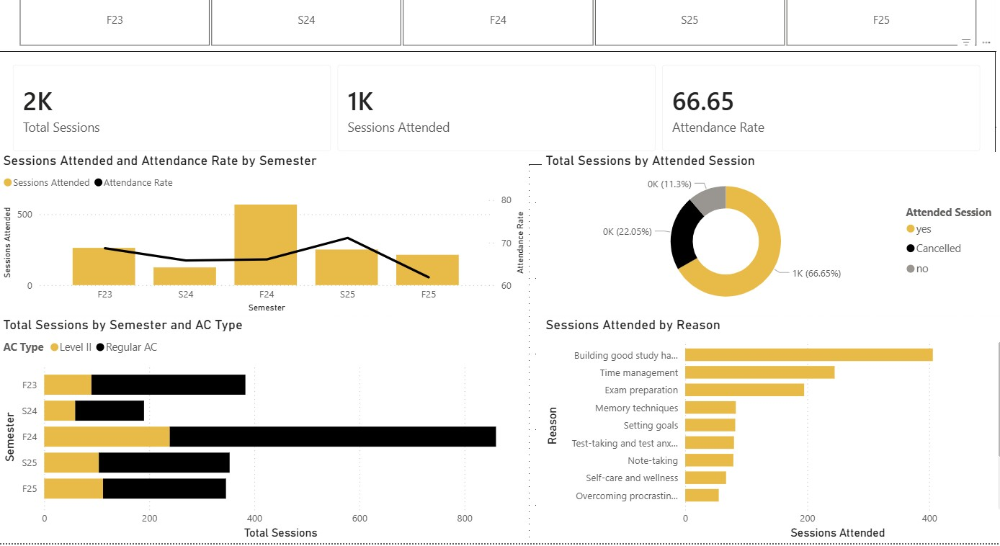
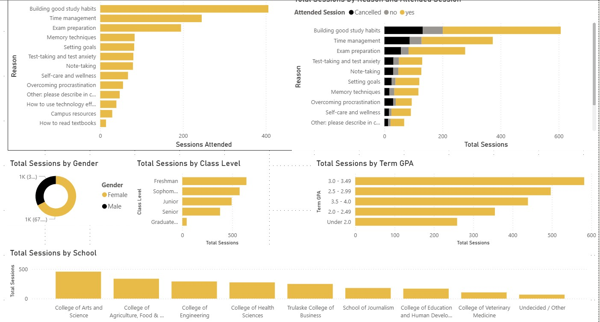
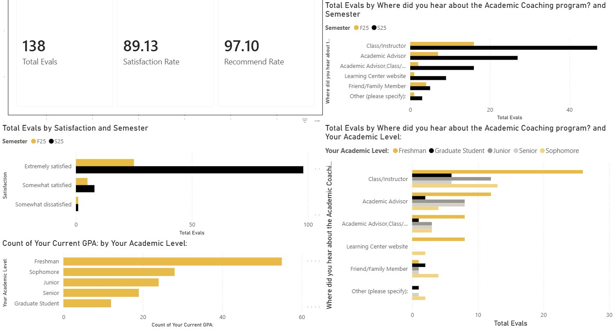

# Screenshots

Preview images of each page of the Academic Coaching Power BI dashboard.
These are provided so the report can be reviewed without opening Power BI Desktop.

---

## Page 1 — Overview

Semester-by-semester attended sessions and attendance rate shown as a
combined bar and line chart, session outcome breakdown, appointment type
split between Level II and regular AC, and delivery format.

---

## Page 2 — Topics and Engagement

Coaching topic frequency, topic outcome stacking showing attended versus
cancelled versus no-show per topic, student demographics, and college
breakdown.

---

## Page 3 — Evaluations

Student satisfaction scores by semester, per-dimension helpfulness ratings
across six coaching dimensions, class level and GPA distribution of
respondents, and referral source breakdown.
